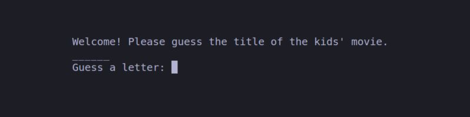
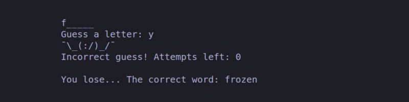

# My JavaScript Final Project 3 🚀✨

## Welcome to my JavaScript project repository 👋

### Shrugman 🤷🤷‍♂️🤷‍♀️ (Pair Work)

### Tools we used

-  JavaScript
-  npm
-  Node.js
-  Linux
-  Git
-  GitHub

### Overview
This interactive command-line game challenges players to guess a randomly selected movie title from a list of popular kids' movies.  
The game provides a series of underscores representing the letters in the movie title, and players must guess individual letters to reveal the hidden word.  
With each correct guess, the hidden letters are unveiled, while incorrect guesses lead to the display of "Shrugman🤷‍♂️" represented as ASCII art.

 

### Setup
The game is written in JavaScript and runs in a Node.js environment.   
Ensure Node.js is installed on your system to play the game.   

### Instructions
- Upon starting the game, a random movie title will be selected from a list of popular kids' movies.
- The game will display a series of underscores, representing each letter in the movie title.
- Players are prompted to guess a letter.
- Enter a letter and press Enter.
- If the guessed letter is correct, it will reveal its position in the movie title. Incorrect guesses will prompt the visual representation of "Shrugman".
- Continue guessing letters until the entire movie title is correctly revealed or the maximum number of attempts is reached.

### Credits
This game is created with Yusra Ahmad.   
Movie titles sourced from a list of popular kids' movies.   

Enjoy playing the game and have fun guessing the movie titles 🎬✨